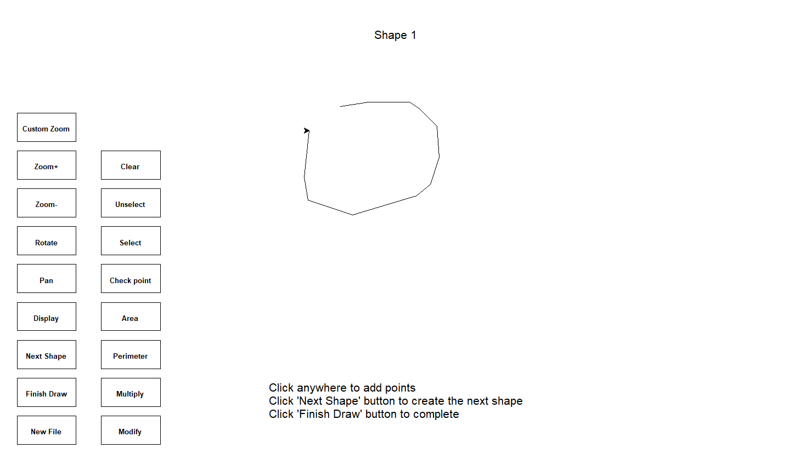
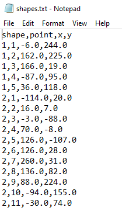
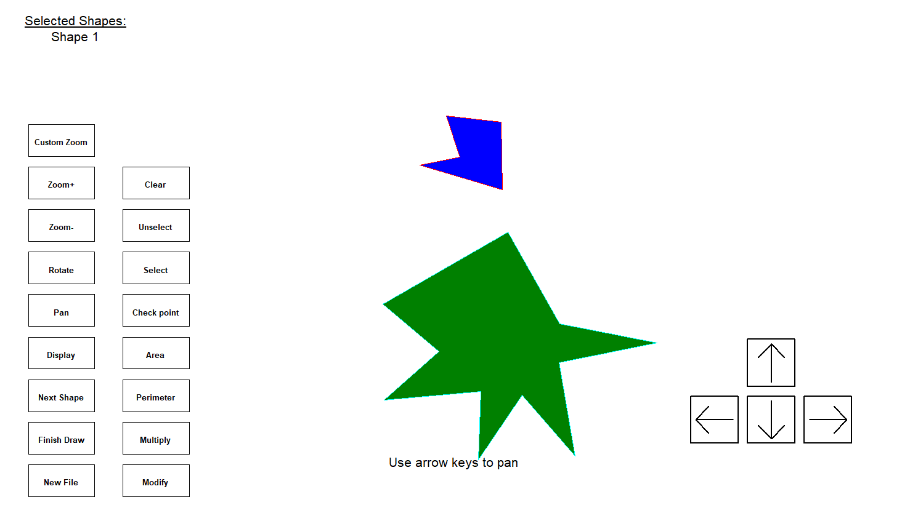
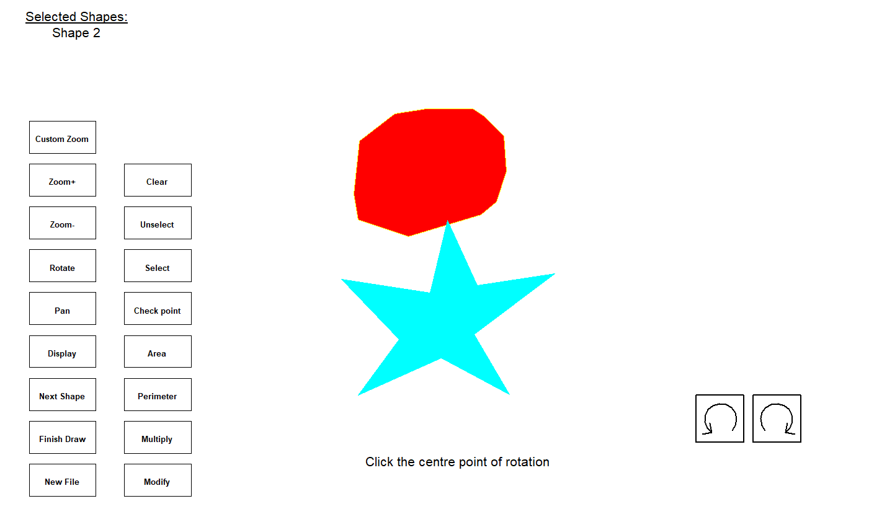
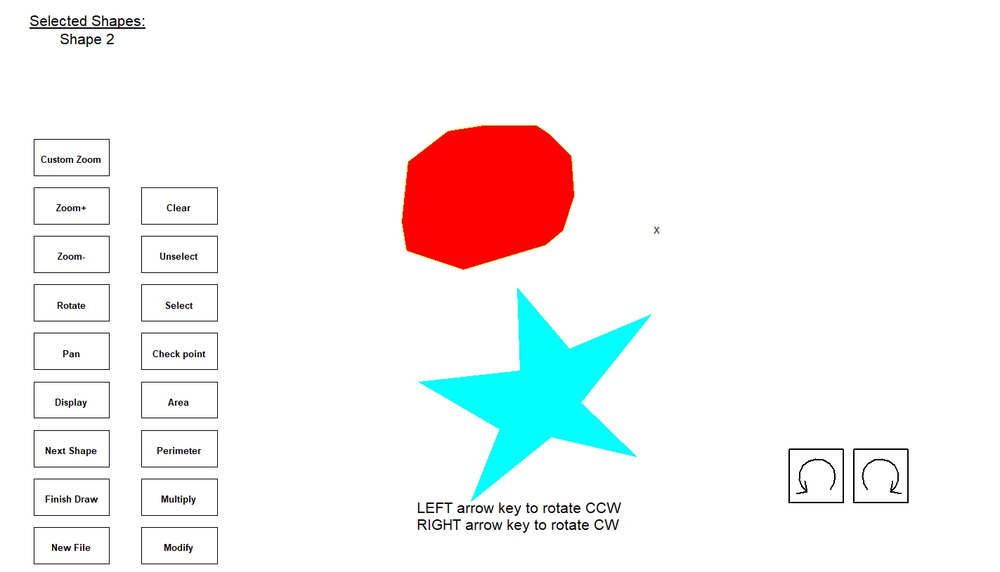
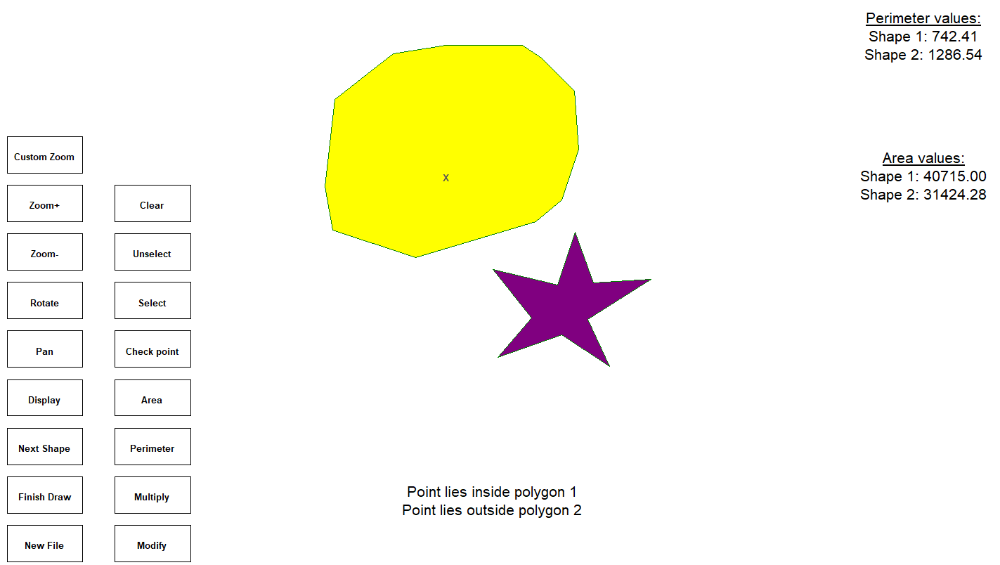

# polygon-designer
Graphical interface to create and interact with polygons made with Python Turtle Library.

Executable with through Python IDLE.

### Polygon Creation
Polygons are created by selecting "New File" button and inserting the various points that make up the polygon.
Points are inserted either by entering the coordinates of the points or through mouse clicks.

  
   

The points of the created polygons are stored into a text file named "shapes.txt".

  
   

The user may edit the points of existing shapes saved in the file.

### Polygon Interaction
After displaying the polygons, they can panned around, rotated, and zoomed in or out.
If multiple polygons are being displayed at once, a specific polygon can be selected to interact with.

  
   
  
   
  
   

### Other Features
The areas and perimeters of the polygons are also calculated and can be displayed by clicking the relevant button.
The user can also check whether a specific poiont lies within or outside of the polygons by typing in the coordinates of the point or clicking on the window screen.

  
   

